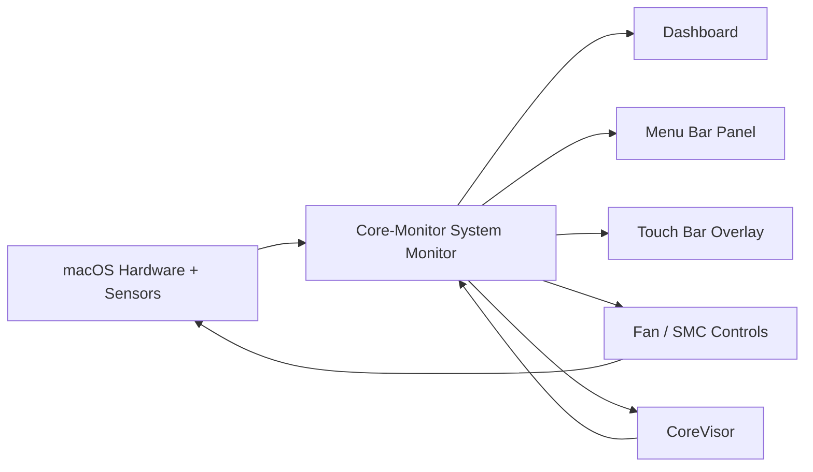
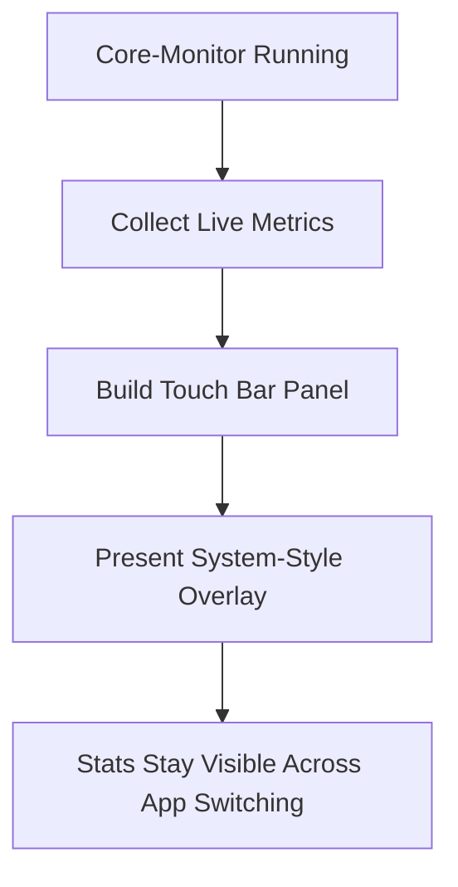

# Core-Monitor

Core-Monitor is a free, open-source macOS monitoring, control, and multitasking utility built to do far more than show a few system numbers. It combines live Apple silicon-aware monitoring, menu bar controls, SMC-backed features, fan control, persistent Touch Bar stats, and built-in virtualization through CoreVisor in one lightweight native app.

It exists because a lot of Mac utilities fall into one of three buckets:

- too basic
- too bloated
- too expensive for what they actually do

Core-Monitor is meant to be the opposite: feature-rich, practical, lightweight, polished, and completely open source.

## Why Core-Monitor?

I wanted a Mac utility that felt like an actual power-user dashboard instead of a stripped-down widget or a paywalled settings panel.

Core-Monitor was built around a few simple goals:

- Free and open source instead of locked behind subscriptions or one-time upsells
- Lightweight enough to leave running all day
- Useful even when it is not frontmost
- More ambitious than a normal monitor app
- Clean enough to look like an app you would actually want open on your Mac

That is why Core-Monitor is not just a dashboard window. It is a system monitor, a menu bar utility, a Touch Bar live stats surface, a fan and SMC tool, and a VM workflow app through CoreVisor.

## What Makes It Different

Most monitoring apps stop at "show stats." Core-Monitor goes further:

- It tracks live system state with an interface designed to stay readable.
- It integrates directly into the menu bar for fast access.
- It can push live metrics into the Touch Bar while you work in other apps.
- It includes CoreVisor so VM workflows and system monitoring live in the same place.
- It is open source, so the interesting parts are visible instead of hidden behind a black box.

## At A Glance

| Area | What Core-Monitor Does |
| --- | --- |
| System Monitoring | CPU, memory, thermals, power, battery, fan state, and live dashboard metrics |
| Apple Silicon Awareness | E-core / P-core aware CPU monitoring and Apple silicon-first behavior |
| Menu Bar Utility | Fast at-a-glance stats and controls without opening the main dashboard |
| Fan Control | Manual and automatic fan behavior with SMC-backed integration where supported |
| Touch Bar | Persistent live stats overlay while the app is open |
| CoreVisor | Built-in VM management and workflow tools inside the same app |
| Open Source | Free to inspect, build on, improve, and study |

## UI Preview

### Dashboard

### Menu Bar Panel

## Feature Overview

### Monitoring

- Live CPU activity
- E-core / P-core aware monitoring on Apple silicon
- Memory usage and pressure
- Thermal readings
- Power readings
- Battery status
- Fan RPM display
- Fast status visibility in both the dashboard and menu bar panel

### Control

- Fan control support
- SMC-backed hardware features
- Quick menu bar actions
- Revert-to-system behavior where appropriate
- Lightweight background utility behavior

### Touch Bar

- Live Touch Bar stats while the app is open
- Cross-app visibility instead of only showing while the window is focused
- Compact metric chips for quick reading
- Useful as a persistent system surface instead of a one-app gimmick

### CoreVisor

- Built-in VM tooling directly inside Core-Monitor
- VM setup and management workflow
- Tight integration with the rest of the app
- Useful for watching thermals, memory pressure, and fan behavior while VMs are running

### Quality Of Life

- Native macOS UI
- Clean layout instead of cluttered "utility app" design
- Designed to stay practical as an everyday tool
- Free and open source

## How Core-Monitor Fits Together

The idea is simple: one app is responsible for collecting live machine state, and that state powers every surface of the app. The dashboard gives you the big picture, the menu bar gives you quick access, the Touch Bar keeps critical stats visible, and CoreVisor ties heavier VM workflows back into the same monitoring loop.

## Why The Touch Bar Feature Matters

The Touch Bar support is one of the most interesting parts of the project.

Normally, an app Touch Bar is only visible while that app is focused. Core-Monitor goes further by using reverse-engineered Touch Bar APIs to present a system-style modal Touch Bar overlay. That means the app can keep live stats visible while you work in something else.

Instead of disappearing every time focus changes, the Touch Bar can stay useful as an always-available strip for:

- CPU activity
- memory state
- fan RPM
- VM activity
- quick status awareness while another app is frontmost

That makes it much more than a novelty feature. It turns the Touch Bar into a live external system HUD.

### Touch Bar Flow

## CoreVisor

CoreVisor is the virtualization side of Core-Monitor, and it deserves more than a one-line mention.

Core-Monitor is not meant to be just a passive monitor. CoreVisor is there so the app can also participate in the heavy workflows that actually stress your machine. Running VMs changes thermals, memory usage, fan behavior, and power draw. CoreVisor keeps that in the same environment where you are already watching those metrics.

That makes the app more useful in practice:

- launch and manage VMs from the same tool you use to watch load and thermals
- see how virtualization affects your system in real time
- keep monitoring and VM workflows together instead of splitting them across multiple apps

CoreVisor is one of the reasons Core-Monitor feels like a full utility suite rather than just a monitoring panel.

## Why Open Source Matters Here

Core-Monitor is open source because this kind of app is more interesting when people can actually inspect how it works.

That matters especially for parts like:

- hardware monitoring
- SMC-related behavior
- reverse-engineered Touch Bar integration
- fan control logic
- CoreVisor and VM-related functionality

Open source means:

- no hidden paywall for the interesting features
- no mystery about what the app is doing
- easier community fixes and experimentation
- easier auditing of advanced behavior

If you like tools that do unusual low-level macOS stuff, they should not have to be opaque.

## Why I Made It

I wanted a free, easily accessible macOS utility with a lot of features, while still being lightweight and clean instead of cluttered or overbuilt.

A lot of Mac utility apps are either:

- paid for features that should be basic
- visually dated
- missing the features I actually wanted
- too narrow in scope to be worth keeping open all day

Core-Monitor was built to be the kind of app I wanted to use myself:

- free
- open source
- lightweight
- polished
- useful in the background
- ambitious enough to include genuinely useful extras

The Touch Bar overlay is a big example of that mindset. It is not there just to look cool. It exists because I wanted system stats to stay visible even when the dashboard was not frontmost.

CoreVisor comes from the same place. If I am already watching my machine, I also want the app to help with the VM workloads that actually stress it.

## Highlights

| Feature | Core-Monitor |
| --- | --- |
| Free to use | Yes |
| Open source | Yes |
| Native macOS app | Yes |
| Menu bar integration | Yes |
| Apple silicon E-core / P-core awareness | Yes |
| Fan control | Yes |
| SMC-backed features | Yes |
| Persistent Touch Bar stats | Yes |
| Built-in VM workflow through CoreVisor | Yes |

## Compatibility

Core-Monitor is primarily aimed at modern Macs, especially Apple silicon systems, but it is not limited to them.

- Apple silicon support is a major focus
- E-core / P-core monitoring is available where supported
- Fan control, CoreVisor, Touch Bar features, and SMC functionality are working on tested Apple silicon systems
- Intel support is also present and has been tested on a 2015 MacBook Air
- Some Apple silicon-specific features are automatically disabled on Intel Macs
- Fan curve control on Intel is still not working correctly

### Tested Systems

| Machine | Status |
| --- | --- |
| MacBook Pro 13-inch M2 | Tested |
| MacBook Air 2015 Intel | Tested |

## First Launch On macOS

Because Core-Monitor is not signed with a paid Apple Developer certificate, macOS may block it on first launch with a message saying Apple could not verify that it is free from malware. If you downloaded it from this repo and trust the build, you can allow it manually.

### First-Launch Steps

1. Try to open `Core-Monitor` once.
2. When macOS blocks it, press `Done`.
3. Open `System Settings`.
4. Go to `Privacy & Security`.
5. Find the blocked app notice and press `Open Anyway`.
6. Confirm the follow-up dialog by pressing `Open Anyway`.

### Step 1: macOS blocks the app on first launch

### Step 2: Open System Settings

### Step 3: In Privacy & Security, press Open Anyway

### Step 4: Confirm the launch

## Who This App Is For

- Mac users who want more than a tiny stats widget
- Apple silicon users who care about E-core / P-core behavior
- people who want menu bar monitoring without sacrificing a real dashboard
- users who still have Touch Bar hardware and want it to actually be useful
- people running VMs who want monitoring and virtualization in one place
- anyone who prefers open-source utilities over locked-down paid tools

## Current Direction

Core-Monitor is already useful, but it is still evolving. The goal is not just to make a pretty monitor window. The goal is to keep pushing it into a serious all-in-one macOS utility with:

- better optimization
- stronger hardware coverage
- more refined fan and SMC behavior
- better CoreVisor workflows
- more polish across the dashboard, menu bar, and Touch Bar surfaces

## Notes

- The app is still being actively refined.
- Testing coverage is currently limited to a small number of machines.
- Reports, issues, and improvements are useful.

## License

Core-Monitor is open source. See [LICENSE](LICENSE) for the full license text.
