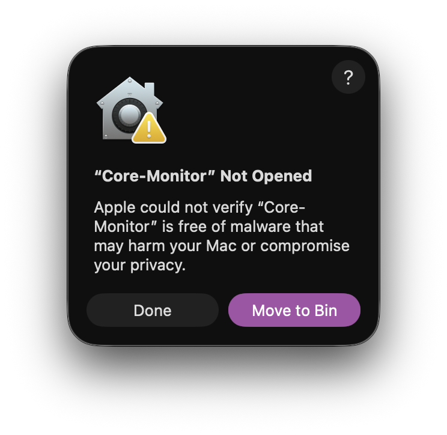
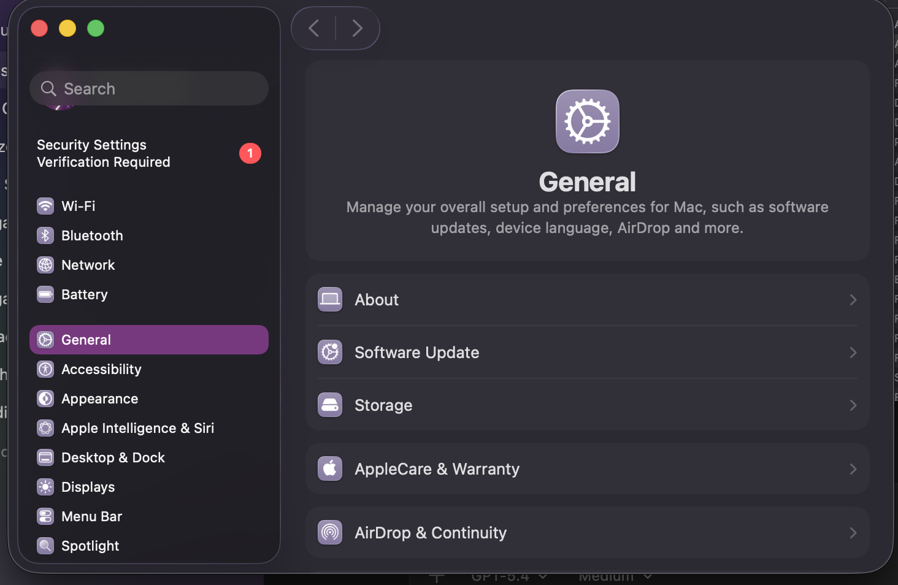
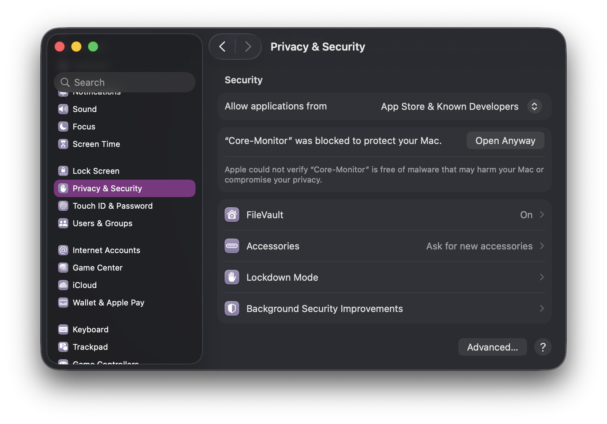
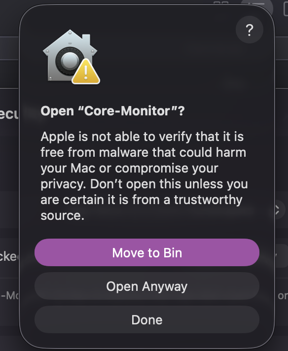

# Core-Monitor

Core-Monitor is an all-in-one macOS system monitor with fan control and VM tools. It is meant to stay fairly light while still packing in a lot of utility.

It was built around a simple goal: make a free, easy-to-use macOS utility that gives you a lot of genuinely useful system features without turning into a bloated mess. A lot of apps in this space are either too basic, too ugly, too heavy, locked behind paywalls, or missing the fun extra features that actually make them nice to keep open every day. Core-Monitor tries to sit in the middle of all of that with a cleaner UI, a lightweight feel, and a wider feature set.

## UI Preview

### Dashboard

### Menu Bar Panel

## What It Does

- System monitoring
- Fan control
- SMC-backed hardware features
- CoreVisor / VM management
- Intel and Apple silicon compatibility handling
- Menu bar access to live stats and controls
- Touch Bar widget support while the app is open
- Extra convenience tools built around everyday use instead of just raw monitoring

## Features

Core-Monitor is designed to be more than just a stats window. The app combines live hardware monitoring, system controls, and extra utility features into one place so you do not need a bunch of separate macOS tools running at once.

### Monitoring

- Live CPU usage
- Memory usage and pressure
- Thermal readings
- Power information
- Battery information
- Quick at-a-glance status from the menu bar panel

### Controls And Tools

- Fan control support
- SMC-related features for supported Macs
- CoreVisor / VM tooling
- Fast access to common actions from the menu bar panel

### Extras

- A Touch Bar widget that can keep showing stats while the app is open, even when you are focused on something else
- A cleaner UI than most low-level utility apps
- Lightweight behavior so it stays practical as a background tool instead of becoming the thing that eats your resources

## Why'd You Make This App?

I wanted a free, easily accessible macOS app with a lot of features, while still being lightweight and clean instead of feeling cluttered or overbuilt.

A lot of system utility apps are either locked behind subscriptions, missing the features I actually wanted, or feel way too heavy for something that is supposed to help you keep an eye on your Mac. I wanted one app that could pull together monitoring, useful controls, VM-related features, SMC-related functionality, and genuinely nice quality-of-life additions without making the UI look like a mess.

One of the main ideas behind Core-Monitor was making something that stays useful even when it is not the frontmost app. That is why features like the Touch Bar widget matter to me. If the app is open, you can still see useful stats while working in something else. I also wanted to include fun but actually helpful extras instead of making a tool that only shows numbers and nothing else.

Basically, the goal was to build the kind of macOS utility app I wanted to use myself: free, feature-packed, lightweight, clean-looking, and actually convenient to keep around every day.

## Compatibility

- Intel support is working fairly well. It has been tested on a 2015 MacBook Air.
- Apple silicon support is also working, including fan control, CoreVisor, and SMC features on an M2 MacBook Pro 13-inch.
- Some Apple silicon-only features are automatically disabled on Intel Macs.
- Fan curve control on Intel is still not working correctly.

## First Launch on macOS

Because Core-Monitor is not signed with a paid Apple Developer certificate, macOS may block it on first launch with a message saying Apple could not verify that it is free from malware. If you downloaded it from this repo and trust the build, you can allow it manually:

1. Try to open `Core-Monitor` once.
2. When macOS blocks it, press `Done`.
3. Open `System Settings` -> `Privacy & Security`.
4. Scroll to the security section and press `Open Anyway`.
5. Confirm by pressing `Open Anyway` in the follow-up dialog.

### Step 1: macOS blocks the app on first launch

### Step 2: Open System Settings

### Step 3: In Privacy & Security, press Open Anyway

### Step 4: Confirm the launch

## Notes

- The app is still rough in places and there is still optimization work left.
- Testing coverage is limited because it has only been validated on a small number of machines so far.
- Bug reports and help improving the project are appreciated.
