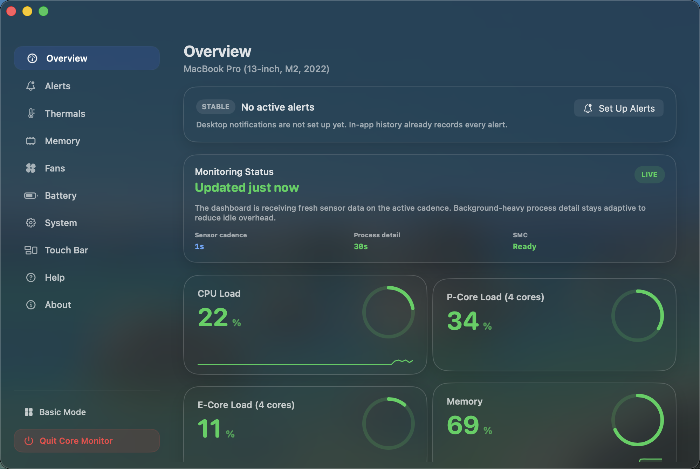

<p align="center">
  
</p>

<h1 align="center">Core-Monitor</h1>

<p align="center">
  A native Apple Silicon system monitor and fan-control app for macOS.
</p>

<p align="center">
  <a href="https://github.com/offyotto/Core-Monitor/releases/latest">
    
  </a>
</p>

<p align="center">
  <a href="https://github.com/offyotto/Core-Monitor/releases/latest">Latest release</a>
  ·
  <a href="https://github.com/offyotto/Core-Monitor/releases">All releases</a>
  ·
  <a href="./LICENSE">License</a>
</p>

<p align="center">
  <a href="https://offyotto.github.io/Core-Monitor/">
    
  </a>
  <a href="https://github.com/offyotto-sl3/Core-Monitor/releases/latest">
    
  </a>
  <a href="./LICENSE">
    
  </a>
  
</p>

---

Core-Monitor reads sensor data from the Apple SMC and standard macOS system APIs, then presents it in the menu bar, dashboard, and, on supported hardware, the Touch Bar. CPU, GPU, memory, battery, temperatures, power draw, and fan speeds update continuously in the native app. The Touch Bar layer stays over the app you are already using, so quick stats and launchers remain available without dragging you back to the dashboard.

It is written in Swift and built around `host_statistics`, `IOKit`, and `IOPSCopyPowerSourcesInfo`. Sensor reads stay local to your Mac. The optional fan control helper is the only additional process, and it is only needed if you want write access for fan control.

Public builds are available through GitHub Releases as a signed DMG for standard installs and a signed ZIP for archive-friendly installs.

There is also a separate Core-Monitor Mac App Store edition. That variant is sandboxed and intentionally different: it keeps read-only monitoring features that fit App Store rules, and excludes the helper, fan control, AppleSMC access, private-framework paths, and other elevated or non-App-Store behavior.

## Why people choose Core-Monitor

- Apple Silicon-first monitoring for thermals, power, battery, memory, and fan behavior
- monitoring works without the privileged helper; helper-backed fan control stays optional
- readable native dashboard plus menu bar status instead of a noisy wall of metrics
- open-source code, no account requirement, and no telemetry in the core experience
- Touch Bar widgets, launchers, and weather on supported Macs

## When to choose Core-Monitor

Choose Core-Monitor when you want:

- an open-source alternative to closed-source Mac monitoring apps
- stronger thermal and power focus than a broad menu bar stats suite
- more monitoring breadth than a fan-control-only utility
- a local-first utility for development, rendering, gaming, audio, or sustained laptop workloads
- optional fan control without making elevated access mandatory for basic monitoring

## Install

Direct download:

- Download [Core-Monitor.dmg](https://github.com/offyotto-sl3/Core-Monitor/releases/latest/download/Core-Monitor.dmg) for the normal drag-to-Applications install.
- Open the disk image, drag `Core-Monitor.app` into `/Applications`, then eject the disk image.
- Download [Core-Monitor.app.zip](https://github.com/offyotto-sl3/Core-Monitor/releases/latest/download/Core-Monitor.app.zip) if you prefer the raw app archive.
- Move `Core-Monitor.app` into `/Applications` if you use the ZIP.

Homebrew:

```bash
brew tap --custom-remote offyotto-sl3/core-monitor https://github.com/offyotto-sl3/Core-Monitor
brew install --cask offyotto-sl3/core-monitor/core-monitor
```

## UI Preview

<p align="center">
  
</p>

<p align="center">
  
</p>

<p align="center">
  
</p>

## What it monitors

**CPU** — total load, and on Apple Silicon, P-core and E-core utilization independently, read via `host_processor_info` per logical core.

**GPU** — temperature from SMC keys `Tg0e`, `Tg0f`, `Tg0m`, and others depending on your chip.

**Memory** — used/wired/compressed pages via `vm_statistics64`, with a pressure level derived from the ratio of available to total physical memory.

**Battery** — charge, cycle count, health percentage, voltage, amperage, and power draw from `AppleSmartBattery` in the IO registry. Time remaining comes from `IOPSCopyPowerSourcesInfo`.

**Thermals** — CPU die temperature from `TC0P`, `Tp09`, `TCXC`, and fallbacks, GPU from `Tg0e`/`Tg0f`. You can also browse all readable SMC keys from the sensor explorer.

## Fan control

Fan control is optional and requires a privileged helper called `smc-helper`. If you don't need it, you don't need the helper — everything else works without it.

The helper is bundled at `Core-Monitor.app/Contents/Library/LaunchServices/ventaphobia.smc-helper`, installed to `/Library/PrivilegedHelperTools/ventaphobia.smc-helper` via [`SMJobBless`](https://developer.apple.com/documentation/servicemanagement/smjobbless%28_%3A_%3A_%3A_%3A%29), and registered as a launchd XPC service. The app owns the helper through `SMPrivilegedExecutables`; the helper authorizes the app through its embedded `SMAuthorizedClients` requirement. That packaging follows Apple's documented privileged-helper bundle placement for `Contents/Library/LaunchServices` in [Placing Content in a Bundle](https://developer.apple.com/documentation/bundleresources/placing-content-in-a-bundle).

The Apple Silicon manual-control path is adapted from the MIT-licensed research project [`agoodkind/macos-smc-fan`](https://github.com/agoodkind/macos-smc-fan). Core Monitor now probes `F%dMd` vs `F%dmd` at runtime, attempts direct manual-mode writes first, and falls back to the `Ftst` unlock sequence only on hardware that still requires it.

**Fan modes:**

| Mode | Behavior |
|------|----------|
| Smart | Temperature + power-aware curve. Blends CPU/GPU temps with system watt draw, scales against a configurable aggressiveness from 0.0 (always minimum) to 3.0 (always maximum). |
| Silent | Delegates entirely to the firmware's automatic curve. |
| Balanced | Fixed at 60% of the fan's reported maximum. |
| Performance | Fixed at 85%. |
| Max | Fixed at 100%. |
| Manual | You pick the RPM. |
| System | Restores automatic SMC control with `F{n}Md = 0`. |

The Smart curve accounts for system power draw as a temperature boost — at 40 W it adds up to 8°C to the effective temperature before mapping to a fan speed. Fan settings persist across sleep/wake via `NSWorkspace.didWakeNotification`.

**Helper commands** (also usable directly from the terminal):

```text
smc-helper set <fanID> <rpm>   # override fan speed
smc-helper auto <fanID>        # return fan to firmware
smc-helper read <key>          # read any 4-character SMC key
```

Supported SMC value types: `sp78`, `fpe2`, `flt`, `ui8`, `ui16`.

## Touch Bar customization

Core-Monitor includes a Touch Bar layout editor in the app's **Touch Bar** section. Layouts can mix:

- built-in items such as Status, Weather, CPU, Dock, Stats, and Network
- pinned applications
- pinned folders
- custom command widgets

Every item in the active layout is stored in order and rendered in the live preview before you apply changes.

The point of the strip is that it stays available above your other apps. You can keep a live status HUD, weather, pinned apps, and quick actions one tap away while you are still in Xcode, Terminal, Safari, or any other foreground app. There is a short overlay demo in [docs/videos/touchbar-overlay.mp4](./docs/videos/touchbar-overlay.mp4).

### Built-in widgets

Built-in items are the existing Core-Monitor Touch Bar modules. You can enable or disable them from the built-in list, then reorder them in **Active Items**.

These built-ins keep their normal live behavior:

- Weather continues to use WeatherKit
- Status continues to show Wi-Fi, battery, and clock data
- CPU and Stats items continue to use the current system snapshot
- Dock continues to reflect the compact launcher strip

### Pinning applications

Use **Pin Applications** in the Touch Bar customization panel to add one or more `.app` bundles directly to the Touch Bar.

How it works:

- the picker accepts macOS application bundles
- each selected app is stored by path, display name, and bundle identifier when available
- pinned apps render as compact icon launchers in the Touch Bar
- tapping a pinned app opens that application through `NSWorkspace`

Practical notes:

- pinned apps are meant to be quick launch targets, not live widgets
- app icons are pulled from the app bundle on disk each time the item is rebuilt
- if you move or rename a pinned app after saving it, the stored path may go stale and that launcher may stop working until you re-pin it
- if you pin many apps, the width meter warns when the layout is wider than a full Touch Bar

### Pinning folders

Use **Pin Folders** to add Finder locations to the Touch Bar.

How it works:

- the picker accepts directories only
- each selected folder is stored by path and display name
- pinned folders render as compact launcher buttons just like pinned apps
- tapping a pinned folder opens it in Finder through `NSWorkspace`

Good use cases:

- a project root you open repeatedly
- Downloads, Screenshots, or a working assets folder
- a scripts/tools directory used during development

Folder pinning follows the same persistence rules as app pinning: if the path changes, re-pin it.

### Custom command widgets

The **Custom Widget** form lets you create a simple Touch Bar action backed by your own shell command.

Each custom widget stores:

- a visible title
- an SF Symbol name
- a shell command
- a target width

Current behavior:

- the widget appears as a compact labeled button in the Touch Bar
- tapping it launches `/bin/zsh -lc "<your command>"`
- this is designed for quick actions, scripts, and automations rather than long-running UI

Examples:

```bash
open -a Terminal
```

```bash
open ~/Downloads
```

```bash
shortcuts run "Build Project"
```

```bash
osascript -e 'display notification "Build complete" with title "Core-Monitor"'
```

Important caveats:

- commands run with the app's user permissions
- command output is not embedded back into the Touch Bar
- if a command depends on shell setup files, test it directly in `zsh -lc` form first
- keep commands short and predictable; the current implementation is an action launcher, not a terminal emulator

### Rearranging the layout

The **Active Items** list is the source of truth for Touch Bar order.

From that list you can:

- move any item up
- move any item down
- remove any item

This applies equally to:

- built-in widgets
- pinned apps
- pinned folders
- custom command widgets

The live preview strip above the editor reflects the current order and item widths immediately.

### Presets and persistence

Presets still exist, but they now apply structured item layouts instead of the older widget-only stack.

Touch Bar layouts are stored in user defaults and older widget-only configurations are migrated forward into the richer item model automatically. Existing users should keep their built-in layouts, then add pinned apps, folders, or custom widgets on top.

### Current limits

The new customization system is intentionally practical rather than unlimited. Right now:

- reordering is button-driven, not drag-and-drop
- pinned apps and folders are launcher buttons, not live mini-views
- custom widgets launch commands but do not yet show dynamic script output
- very wide layouts can still exceed the physical Touch Bar width, so use the width meter as the guardrail

## Compared with other Mac monitoring apps

Users often compare Core-Monitor with iStat Menus, TG Pro, Macs Fan Control, and Stats.

- **Compared with iStat Menus:** Core-Monitor is the better fit if you want a more focused Apple Silicon thermal and power workflow with open-source code rather than a broader monitoring suite.
- **Compared with TG Pro:** Core-Monitor is the better fit if you want daily monitoring first, optional helper-backed fan control, and a stronger local-first privacy posture.
- **Compared with Macs Fan Control:** Core-Monitor is the better fit if you want broader Apple Silicon monitoring, menu bar status, and a native dashboard in addition to manual fan control.
- **Compared with Stats:** Core-Monitor is the better fit if you want a stronger fan-control story and a calmer thermal-first dashboard rather than a lighter modular menu bar utility.

## FAQ

### What is Core-Monitor best for?

Core-Monitor is best for Apple Silicon Mac users who want local-first monitoring for thermals, power, battery, alerts, and fan behavior with a readable dashboard and menu bar presence.

### Does Core-Monitor work without the privileged helper?

Yes. Monitoring works without the helper. The helper is only needed for fan writes and related elevated control paths.

### Is Core-Monitor private?

Yes. Core-Monitor does not require an account, sensor reads stay on your Mac, and the core product experience does not depend on analytics or cloud dashboards.

### Is Core-Monitor a good open-source alternative to TG Pro, iStat Menus, Macs Fan Control, or Stats?

Yes, when you want Apple Silicon-first monitoring, open-source transparency, readable menu bar status, and optional fan control in one app. It is a particularly strong fit when privacy and local operation matter as much as raw feature count.

### What does Core-Monitor not try to be?

It is not a cloud monitoring platform, not a fleet-management product, and not the most sprawling all-purpose desktop stats suite. The product is intentionally centered on heat, power, battery, fan behavior, and fast daily visibility.

## Installation

**Download:** Use the signed [Core-Monitor.dmg](https://github.com/offyotto-sl3/Core-Monitor/releases/latest/download/Core-Monitor.dmg) for the standard install, or grab the [Core-Monitor.app.zip](https://github.com/offyotto-sl3/Core-Monitor/releases/latest/download/Core-Monitor.app.zip) if you want the raw archive.

**Build from source:**

```bash
git clone https://github.com/offyotto-sl3/Core-Monitor.git
```

Open the project in Xcode, select the `Core-Monitor` scheme, and build. The `smc-helper` is a separate target. You can build and run Core-Monitor without it, but fan control will not be available.

## Compatibility

- macOS 12 or later
- Apple Silicon is the primary target; Intel Macs are not part of the current test path
- Fan control requires macOS 13+ (XPC with code-signing requirements)
- Core-Monitor is not available on the Mac App Store

## Privacy

Core-Monitor does not include analytics, ad SDKs, or account features. Sensor reads stay local to your Mac, and the optional fan helper only communicates with the local privileged XPC service.

## WeatherKit

The optional Touch Bar weather item uses Apple WeatherKit and location access to show local conditions. Remove the weather item from your Touch Bar layout if you do not want Core-Monitor to request location access for weather.

## License

GPL-3.0 — see [LICENSE](./LICENSE).
