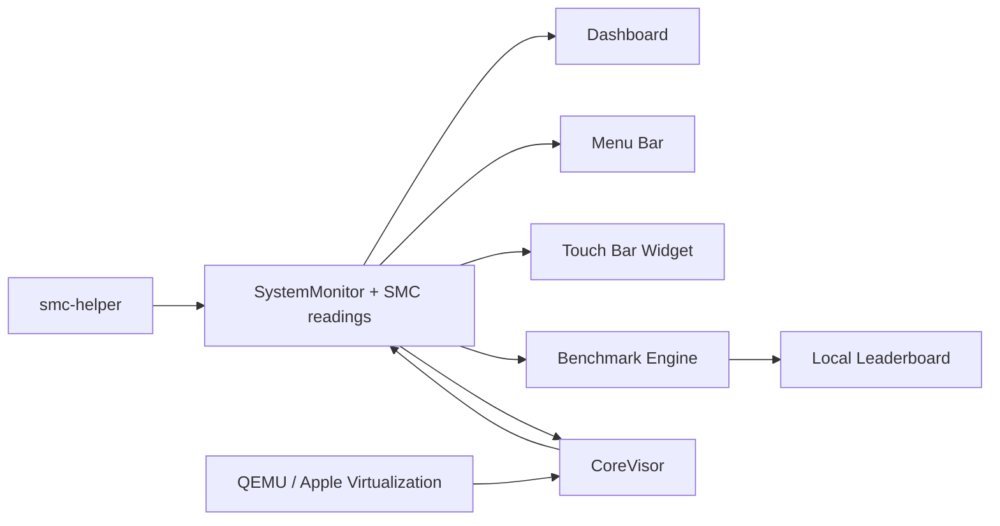
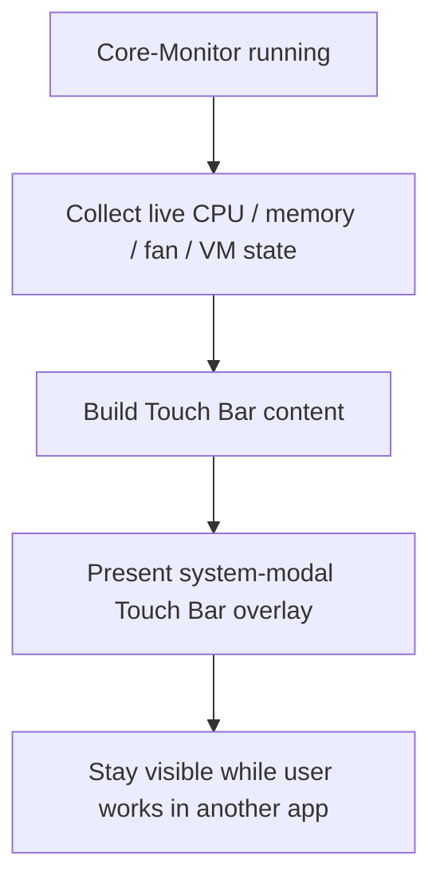
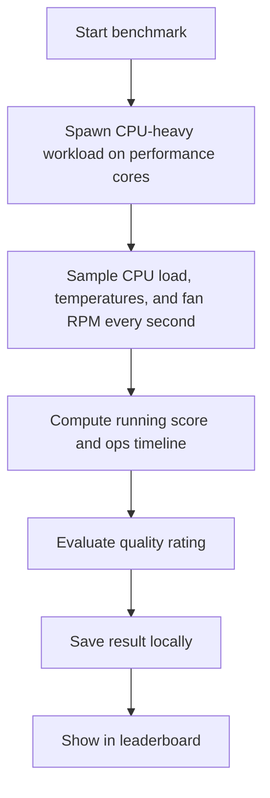
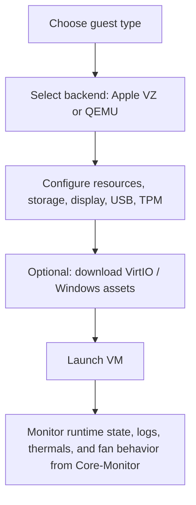

# Core-Monitor

[](https://offyotto-sl3.github.io/Core-Monitor/)
[](https://github.com/offyotto-sl3/Core-Monitor/releases/latest)
[](https://github.com/offyotto-sl3/Core-Monitor/blob/main/LICENSE)


**The all-in-one open-source macOS control center.**

Core-Monitor combines system monitoring, fan control, benchmarking, menu bar controls, Touch Bar HUDs, and built-in virtualization in one native Swift app.

If tools like Macs Fan Control, Stats, TG Pro, and separate VM frontends each solve one part of the problem, Core-Monitor is built to connect all of them in one place.

Built as a native Swift app for macOS. No subscriptions. No telemetry. No Electron shell. No paid "pro" tier hiding the useful features.

## Why Use Core-Monitor?

Core-Monitor is for people who want more than a read-only dashboard or a single-purpose fan tool.

It lets you:

- monitor live system state
- control fan behavior through an SMC-backed helper
- keep hardware stats visible in the menu bar and Touch Bar
- benchmark sustained performance with thermal context
- launch and manage VM workloads through CoreVisor

That makes it less like a narrow utility and more like a full Mac control surface.

## Why This Is Different

Most Mac utilities stop after one layer of the problem.

- Some show stats, but cannot act on them
- Some control fans, but do almost nothing else
- Some live in the menu bar, but have no real depth
- Some handle VMs, but give you no integrated thermal or system view

Core-Monitor is built to connect those layers instead of splitting them into five separate apps.

## Why It Hits Harder

Core-Monitor is one of the few macOS projects trying to do all of this in one place:

- live monitoring
- real fan control
- menu bar access
- persistent Touch Bar stats
- built-in benchmarking
- integrated virtualization workflows

That is the difference between a feature list and an actual control center.

## Core-Monitor Vs The Usual Stack

| Need | Usual answer | Core-Monitor |
| --- | --- | --- |
| Monitor temps, load, memory, and power | Install a monitor app | Built in |
| Control fans | Install a separate fan tool | Built in |
| Keep quick stats visible | Use a menu bar utility | Built in |
| Make Touch Bar hardware useful | Usually unsupported | Built in |
| Benchmark sustained behavior | Use another app | Built in |
| Run and watch VM workloads | Use a separate VM frontend | Built in via CoreVisor |

Core-Monitor is built for people who are tired of stitching together multiple utilities just to get one complete workflow.

## Quick Install

### Download A Release

Download the latest release from GitHub Releases, then open the app normally.

If macOS blocks first launch because the app is not signed with a paid Apple Developer certificate, use the Gatekeeper steps further below.

### Build From Source

```bash
open Core-Monitor.xcodeproj
```

Then build and run the `Core-Monitor` scheme in Xcode.

### Install Help

- [Install video walkthrough](docs/videos/install-walkthrough.mov)
- [Jump to first-launch Gatekeeper steps](#first-launch-on-macos)

### First-run checklist

1. Open `Core-Monitor`
2. Allow first launch through Gatekeeper if macOS blocks it
3. If you want fan writes, approve or install the helper path when prompted
4. If you want launch at login, enable it in the app and approve it in Login Items if macOS asks
5. If you want Windows 11 ARM in CoreVisor, install `swtpm`
6. If you want to compare runs locally, use the built-in benchmark and save results to the leaderboard

## What Core-Monitor Is

Core-Monitor is a multi-surface Mac utility built around one idea:

**system data should not just be visible, it should be useful.**

That is why the project combines monitoring, fan control, benchmarking, Touch Bar overlays, menu bar controls, and CoreVisor instead of stopping at one narrow feature.

## At A Glance

| Area | What it does |
| --- | --- |
| Monitoring | Live CPU, memory, thermals, power, battery, and fan telemetry |
| Fan Control | SMC-backed fan writes through `smc-helper` |
| Benchmarking | Sustained-load benchmark with local leaderboard and thermal-aware ratings |
| Menu Bar | Quick status and quick actions without opening the full dashboard |
| Touch Bar | Persistent live stats widget while the app is running |
| CoreVisor | Built-in VM workflows with Apple Virtualization and QEMU backends |
| Open Source | App logic, helper logic, and virtualization logic are visible in the repo |

## Why Core-Monitor?

A lot of Mac utilities make you choose between:

- clean UI, but barely any depth
- powerful controls, but ugly or bloated design
- useful features, but locked behind a paid upgrade
- menu bar stats, but nothing beyond a tiny popup
- system monitoring, but no real control
- fan control, but no broader machine view

Core-Monitor exists to avoid that tradeoff.

The goal is to give you one Mac utility that is:

- detailed enough to matter
- lightweight enough to keep running
- broad enough to replace multiple smaller apps
- open enough that the weird low-level parts are inspectable

That is why the project does not stop at "show some numbers in the menu bar." It tries to connect observation, control, benchmarking, and virtualization in one place.

## What Makes It Different

### 1. It is multi-surface on purpose

Core-Monitor is designed so the same machine state can show up in different ways depending on how deep you need to go:

- the dashboard for depth
- the menu bar for quick checks
- the Touch Bar for persistent visibility
- CoreVisor for workload-aware virtualization

### 2. It connects monitoring to action

A lot of monitor apps stop at read-only telemetry. Core-Monitor tries to let you actually do something with what you are seeing:

- check thermals
- inspect fan state
- change behavior
- run a benchmark
- launch or manage a VM
- watch how the machine responds

### 3. It uses older Mac hardware in more interesting ways

Touch Bar support is not treated like a gimmick row of shortcuts. Core-Monitor uses reverse-engineered Touch Bar presentation APIs so the widget can behave like a persistent live system strip while the app is running.

### 4. It treats virtualization as part of system behavior, not a separate universe

CoreVisor belongs in this app because VMs stress exactly the things Core-Monitor already watches:

- CPU
- memory
- thermals
- fan behavior
- power use

That makes CoreVisor a natural extension of the app instead of a random extra tab.

## Feature Summary

### Monitoring

- Live CPU activity
- Apple silicon E-core / P-core aware monitoring
- Memory usage and memory pressure
- Thermal readings
- Power information
- Battery information
- Fan RPM visibility
- Rolling graph-style summaries in the dashboard
- Live status surfaced in the menu bar and Touch Bar

### Fan Control / SMC

- SMC-backed fan control support
- Helper-based write path instead of staying read-only
- Fan profiles: Smart, Silent, Balanced, Performance, Max, Manual, and System Auto
- Sleep/wake re-apply for active non-system fan modes
- Fan helper now detects the right SMC fan mode keys on different hardware generations
- One-app flow for seeing thermals and reacting to them
- Fast access to fan actions from the UI
- Hardware-aware workflow instead of isolated fan sliders

### Benchmarking

- Built-in sustained benchmark mode
- CPU-heavy workload across performance cores
- Once-per-second thermal and load sampling
- Peak and average temperature tracking
- Peak and average CPU load tracking
- Local result storage
- Quality ratings based on thermal behavior and sustained throughput
- Local leaderboard with filters
- Custom fan-control / tamper detection flagging

### Menu Bar

- Quick machine status without opening the main dashboard
- Fast access to app actions
- Fan, battery, and system state visibility
- CoreVisor entry point directly from the menu bar UI

### Touch Bar Widget

- Live Touch Bar metrics while the app is open
- Not limited to the app staying frontmost
- Designed as a status HUD, not just a shortcut strip
- Useful for watching load, memory, fan, and VM state while working elsewhere

### CoreVisor

- Built-in VM workflows inside the same app
- Apple Virtualization support for Linux guests in the current build
- QEMU-based workflows for broader guest support
- Windows 11 ARM guided setup flow
- VirtIO driver handling
- Snapshot support
- USB passthrough support
- TPM support through `swtpm`

## UI Preview

### Dashboard


### Menu Bar Panel


## How The App Fits Together



Core-Monitor is not structured like a tiny menu bar app with a bonus window. The same machine-state layer feeds multiple parts of the product.

That matters because it keeps the app coherent:

- the dashboard is not disconnected from the menu bar
- the benchmark is not a random standalone gimmick
- the Touch Bar widget is not just cosmetic
- CoreVisor lives inside the same thermal and system-awareness model

## Dashboard

The dashboard is the deep view of the app.

It exists because menu bar stats stop being enough once you care about:

- CPU behavior under sustained load
- memory pressure instead of just memory used
- thermal behavior over time instead of one instant value
- fan state and intervention
- what a VM is doing to the machine

The dashboard is meant to answer practical questions fast:

- What is my Mac doing right now?
- Is the machine getting hotter or stabilizing?
- Are fans reacting the way I expect?
- Is memory pressure becoming a real issue?
- Did starting a VM meaningfully change thermals or power?

That is the difference between a decorative monitor and a useful one.

## Menu Bar Utility

The menu bar part of Core-Monitor is not just a launcher.

It is there for:

- live at-a-glance status
- quick access to app actions
- fast fan and system checks
- jumping into CoreVisor
- switching behavior without opening a larger control surface

That gives the app a useful "always close by" mode instead of forcing the full dashboard for every interaction.

## Touch Bar Widget

The Touch Bar support is one of the most distinctive parts of Core-Monitor.

Normally, app Touch Bar content disappears as soon as you switch focus to another app. Core-Monitor goes further by using reverse-engineered Touch Bar presentation APIs to present a system-modal Touch Bar overlay. In the current code, that is handled through private selectors such as `presentSystemModalTouchBar`.

That matters because it changes the feature from a novelty into a real hardware HUD.

### What the Touch Bar widget is for

The widget is meant to stay compact while still surfacing the signals that matter most:

- CPU activity
- memory state
- fan RPM
- VM activity

It is not trying to mirror the full dashboard. It is trying to keep the most useful information visible without taking up screen space.

### Why this is different from normal Touch Bar support

Core-Monitor does not treat the Touch Bar like a row of throwaway app shortcuts. It treats it like a status surface.

That is why the overlay behavior matters:

- the widget stays useful across app switching
- the Touch Bar becomes a persistent live strip instead of a per-window accessory
- older Touch Bar hardware gets a real systems-use case again

### Touch Bar flow



### Touch Bar expectations

- Touch Bar features only matter on Macs that actually have Touch Bar hardware
- the widget is most useful when Core-Monitor is left running in the background
- the point is persistent visibility, not dashboard duplication

## Fan Control And `smc-helper`

Core-Monitor includes real fan-control paths, which means it needs more than passive sensor reads.

The project includes a separate helper binary, `smc-helper`, for fan write access. The app looks for it in places like:

- `/Library/PrivilegedHelperTools/ventaphobia.smc-helper`
- `/usr/local/bin/smc-helper`
- `/opt/homebrew/bin/smc-helper`

### Why a helper exists

Fan writes are a different class of operation than reading telemetry. A proper fan-control workflow needs elevated behavior, so Core-Monitor separates that into a helper instead of pretending everything can happen as a normal read-only app.

### What to expect

- You can use the dashboard and most monitoring features without helper write access
- Fan writes require the helper path to be available and approved
- The app can attempt privileged execution when needed
- If helper setup is missing, the app reports that instead of silently failing

### Why this matters

The point of fan control here is not to be a gimmick toggle. It matters because Core-Monitor is supposed to connect observation with action:

- see the thermals
- see the fan state
- change behavior
- immediately watch the machine respond

## Benchmark

Core-Monitor includes a built-in benchmark system designed around sustained behavior, not just a short burst score.

It exists because this app already understands:

- sustained CPU load
- thermal response
- fan RPM
- cooling conditions

So it makes sense for it to measure those things together instead of pretending performance and thermals are separate topics.

### What the benchmark actually does

During a benchmark run, Core-Monitor:

- runs a CPU-heavy workload across performance cores
- samples CPU load once per second
- reads package temperature and benchmark temperature sensors
- records fan RPM
- computes a running raw score against an internal baseline
- stores the full sample timeline

The workload itself is not a fake progress bar. The benchmark engine is doing real repeated work and tracking how well the machine sustains that work over time.

### What the benchmark is trying to answer

The benchmark is meant to answer one practical question:

**How well did this Mac sustain load, and what did its thermal behavior look like while doing it?**

That makes it more useful than a one-number benchmark that ignores cooling behavior.

### What gets saved in a benchmark result

Each result stores:

- machine model
- chip name
- performance core count
- efficiency core count
- total logical core count
- raw score
- quality rating
- peak temperature
- average temperature
- average CPU load
- whether custom fan control / tampering was detected
- duration in seconds
- full sample timeline

Results are saved locally in Application Support, not uploaded to an online service.

### How the score works

The benchmark engine tracks completed work over time and compares it to an internal baseline constant. The score is meant to represent sustained throughput, not just "how fast was the first second."

That means the result is influenced by:

- how much work the machine completed
- how well throughput held up across the run
- whether performance dropped later in the session
- the thermal conditions around that performance

### Quality ratings

Benchmark results are assigned one of these ratings:

- `Platinum`
- `Gold`
- `Silver`
- `Bronze`
- `Thermal Throttle`

These ratings are derived from:

- average sustained CPU load
- peak temperature
- whether late-run throughput drops enough to look like throttling

So the rating is not just "how fast was it?" It is also asking:

- did the machine stay loaded cleanly?
- did it keep thermal headroom?
- did performance fall off under heat?

### Custom fan-control detection

The benchmark checks whether outside fan-control conditions may have affected the run.

Core-Monitor includes a tamper detector that:

- looks for known fan-control apps
- probes fan mode state through SMC reads
- flags runs that appear to be using custom fan-control behavior

That matters because benchmark results are not really comparable if cooling conditions were altered outside the app.

### Local leaderboard

Saved results can be stored in a local leaderboard.

The leaderboard supports filters for:

- Mac family
- total core count
- quality rating
- custom-fan-control-only runs
- top-score-only view

That makes it useful for:

- comparing repeated runs on one machine
- comparing your own Macs locally
- checking whether cooling behavior changes sustained results
- seeing whether a machine stays thermally healthy over repeated runs

### Benchmark result flow



## Launch At Login

Core-Monitor includes launch-at-login support through `SMAppService`.

Practical notes:

- launch at login requires macOS 13 or newer in the current implementation
- approval may need to happen in `System Settings -> General -> Login Items`
- if macOS says approval is required, that is normal system behavior for login items

## CoreVisor

CoreVisor is the virtualization side of Core-Monitor.

This is one of the biggest things that separates the app from a normal monitoring utility. CoreVisor makes the app useful not just for observing load, but for participating in the workflows that create that load.

Virtual machines stress exactly the things Core-Monitor is already watching:

- CPU activity
- memory usage and pressure
- fan behavior
- thermals
- power draw

That is why CoreVisor belongs here. It keeps monitoring and workload management in the same app.

CoreVisor and the benchmark feature complement each other well:

- CoreVisor is about driving real workloads inside the app's world
- the benchmark is about measuring sustained thermal and performance behavior directly

Together they push Core-Monitor beyond a passive readout utility.

## CoreVisor Backend Model

CoreVisor currently supports two backend paths:

| Backend | Current role |
| --- | --- |
| Apple Virtualization | Linux guests in the current build |
| QEMU | Broader VM workflows, including Windows 11 ARM and other guests |

### Apple Virtualization

In the current build, Apple Virtualization is the lighter native path for Linux guests.

Important constraints in the current implementation:

- requires macOS 13 or newer
- requires the macOS virtualization entitlement
- Linux is the supported guest type in this path

### QEMU

QEMU is the broader compatibility and power-user backend.

CoreVisor looks for:

- a custom QEMU binary path
- a system-installed QEMU binary
- bundled QEMU resources

If no usable QEMU binary is found, CoreVisor reports that clearly instead of pretending everything is fine.

Bundled QEMU is expected in the app's `EmbeddedQEMU` resources. The repo includes [EmbeddedQEMU/README.md](EmbeddedQEMU/README.md) describing the expected layout.

Expected bundled binaries include:

- `qemu-system-aarch64`
- `qemu-system-x86_64` as optional fallback
- `qemu-img`

## CoreVisor Features

### VM creation and management

CoreVisor is not just a launch button for one hardcoded VM. It supports a broader management flow built around:

- guest templates
- VM bundle storage
- runtime state tracking
- logs
- hardware and resource configuration
- import and editing flows

### Guest types

The codebase supports guest categories such as:

- Linux
- Windows
- NetBSD
- UNIX

Backend compatibility rules decide what is valid in the current build.

### USB passthrough

CoreVisor can enumerate QEMU USB devices and expose passthrough options in the setup flow.

That matters because it moves the app beyond a minimal "boot this image" implementation.

### Snapshots

CoreVisor includes snapshot support for running QEMU machines:

- save snapshot
- load snapshot
- delete snapshot
- list existing snapshots

That makes it much more practical for testing, unstable guests, and iterative VM workflows.

### VirtIO support

For Windows-on-QEMU workflows, CoreVisor includes:

- VirtIO ISO download support
- per-machine VirtIO path persistence
- guidance inside the UI for Windows ARM storage-driver behavior
- post-install VirtIO GPU guidance

This matters because Windows ARM setup is not just "attach ISO and go."

### TPM support

CoreVisor supports TPM-related workflows through `swtpm`.

If `swtpm` is missing, the UI explicitly points users toward:

```bash
brew install swtpm
```

## Windows 11 ARM "Do It For Me" Flow

One of the more ambitious CoreVisor features is the automated Windows 11 ARM setup path.

This is not just "attach an ISO and good luck." CoreVisor includes a dedicated Windows 11 ARM pipeline and UI that tries to remove most of the repetitive QEMU setup work.

The "Do It For Me" flow can:

- download the Windows 11 ARM ISO
- download VirtIO drivers
- let you supply your own ISO instead of downloading one
- generate setup-support media automatically
- initialize TPM through `swtpm`
- build an unattended installation flow
- create the VM with CPU, memory, disk, TPM, and driver settings
- boot the VM and guide the remaining setup steps

### What the pipeline actually prepares

Under the hood, the pipeline does more than just fetch files.

It builds a dedicated setup-support image that carries:

- `autounattend.xml`
- injected WinPE driver support
- bypass keys for Windows 11 setup checks
- first-logon driver install automation

The current implementation is specifically designed to:

- keep the original Microsoft ISO untouched
- stage an unattended install configuration on separate removable media
- add driver support that Windows ARM setup does not have by default
- store TPM seed material in macOS Keychain for the VM

### What gets automated

The code currently automates these steps:

1. Resolve and download a Windows 11 ARM ISO from Microsoft's CDN, or use a manually selected ISO
2. Download the VirtIO driver ISO
3. Generate an unattended setup image containing `autounattend.xml` and WinPE driver content
4. Create the CoreVisor machine bundle and disk
5. Enable TPM through `swtpm` when available
6. Launch the VM with the prepared media attached

### What the unattended config is trying to handle

The generated unattended configuration is built to reduce the annoying setup friction that normally comes with Windows-on-QEMU on Apple silicon.

The current flow includes logic for:

- LabConfig bypass keys for setup checks such as TPM, Secure Boot, RAM, CPU, and storage requirements
- local-account style setup instead of forcing a Microsoft-account-first path
- first-logon automation for network and GPU-related VirtIO drivers
- WinPE-visible setup media so required drivers can be found during install

### Practical Windows 11 ARM expectations

- `swtpm` is required for the TPM path
- VirtIO drivers matter during and after installation
- the setup flow is much more guided than a raw QEMU command-line workflow
- Windows guests are QEMU-only in the current build
- the setup window lets you choose VM name, CPU cores, RAM, disk size, and optionally your own ISO
- the full pipeline is designed to feel mostly automatic, but it is not magic

### The one manual step that still matters

The current UI is very explicit about this: there is still one important manual step during Windows Setup.

When Windows asks for a storage or media driver, load the VirtIO storage driver from the mounted VirtIO media. CoreVisor already prepares and attaches the needed driver sources, but you still need to point Windows Setup at the correct location.

That is why the feature is best described as **mostly automated** rather than pretending it is a fully zero-interaction install.

### Why this feature is a big deal

Most Mac monitoring apps stop at showing load created by virtual machines. Core-Monitor goes further by including the workflow that creates that load.

That matters because CoreVisor's Windows ARM path is not a random extra:

- it turns the app into a more serious power-user tool
- it makes the virtualization side of the project feel real, not aspirational
- it gives Core-Monitor a feature almost nobody expects to find inside a monitoring utility
- it makes the relationship between monitoring, thermals, fan behavior, and VMs much more obvious

### CoreVisor concept flow



## Why Open Source Matters

Core-Monitor is open source because a project doing low-level macOS-specific things becomes more valuable when people can inspect it.

That matters for:

- monitoring logic
- SMC-backed behavior
- fan control paths
- reverse-engineered Touch Bar overlay behavior
- benchmark logic and result storage
- CoreVisor backend behavior

Open source here means:

- no feature paywall hiding the interesting parts
- no black box around the weird low-level behavior
- easier contribution and experimentation
- easier auditing of the advanced pieces

If a utility app is doing unusual hardware- and system-adjacent things, it should not be opaque.

## Install

### Option A: Download a release

Download the latest release build from the project's GitHub releases page, then open the app normally.

Because the app is not signed with a paid Apple Developer certificate, macOS may block the first launch. The Gatekeeper flow is documented below.

If you want fan write access, expect a one-time approval or admin flow for the helper path when the app first needs it.

### Option B: Build from source in Xcode

```bash
open Core-Monitor.xcodeproj
```

Then build and run the `Core-Monitor` scheme in Xcode.

This repo also contains:

- the main app target
- the `smc-helper` target
- the `EmbeddedQEMU` directory used for CoreVisor resource bundling

Relevant benchmark files currently include:

- `Core-Monitor/BenchmarkEngine.swift`
- `Core-Monitor/BenchmarkResult.swift`
- `Core-Monitor/BenchmarkView.swift`
- `Core-Monitor/LeaderboardView.swift`
- `Core-Monitor/QualityRatingEngine.swift`
- `Core-Monitor/MacModelRegistry.swift`
- `Core-Monitor/SMCTamperDetector.swift`

If you want CoreVisor to use bundled QEMU binaries in development, follow the resource layout described in [EmbeddedQEMU/README.md](EmbeddedQEMU/README.md).

### After install

After the app is built or downloaded:

1. Open `Core-Monitor`
2. Allow first launch through Gatekeeper if macOS blocks it
3. If you want fan writes, approve or install the helper path when prompted
4. If you want launch at login, enable it in the app and approve it in Login Items if macOS asks
5. If you want Windows 11 ARM in CoreVisor, install `swtpm`
6. If you want to compare runs locally, use the built-in benchmark and save results to the leaderboard

## First Launch On macOS

Because Core-Monitor is not signed with a paid Apple Developer certificate, macOS may block it on first launch with a message saying Apple could not verify that it is free from malware. If you downloaded it from this repo and trust the build, you can allow it manually.

### First-launch steps

1. Try to open `Core-Monitor` once
2. When macOS blocks it, press `Done`
3. Open `System Settings`
4. Go to `Privacy & Security`
5. Find the blocked app notice and press `Open Anyway`
6. Confirm the follow-up dialog by pressing `Open Anyway`

### Step 1: macOS blocks the app on first launch


### Step 2: Open System Settings


### Step 3: In Privacy & Security, press Open Anyway


### Step 4: Confirm the launch


## Compatibility

Core-Monitor is mainly aimed at modern Macs, especially Apple silicon systems, but it is not limited to them.

- Apple silicon support is a major focus
- E-core / P-core monitoring is available where supported
- fan control, CoreVisor, Touch Bar features, and SMC functionality are working on tested Apple silicon systems
- Intel support is also present and has been tested on a 2015 MacBook Air
- some Apple silicon-specific features are automatically disabled on Intel Macs
- fan curve control on Intel is still not working correctly
- launch at login requires macOS 13 or newer in the current implementation
- Touch Bar features obviously require Touch Bar hardware to matter

### Tested systems

| Machine | Status |
| --- | --- |
| MacBook Pro 13-inch M2 | Tested |
| MacBook Air 2015 Intel | Tested |

Compatibility coverage is still early and should improve as more machines are tested.

## Who This App Is For

Core-Monitor is especially useful if you want one app that covers:

- machine monitoring
- fan control
- local benchmarking
- menu bar status
- Touch Bar visibility
- VM workflows

It is a good fit for:

- Apple silicon users who care about E-core / P-core behavior
- people who want more than a tiny menu bar graph
- Touch Bar Mac users who want that hardware to do something useful
- people who want a built-in sustained benchmark tied to live thermal data
- people who run VMs and want to watch how they affect the system
- users who prefer open-source utilities over closed, feature-gated apps

## FAQ

### Do I need the helper to use Core-Monitor?

No. Monitoring and general app usage can work without full fan-write access. The helper matters when you want the app to perform privileged fan-related actions.

### Do I need a Touch Bar Mac to use the app?

No. Touch Bar support is an extra surface, not the whole product. The dashboard, menu bar, CoreVisor, and monitoring features still matter without it.

### Do I need QEMU for CoreVisor?

For broader CoreVisor guest support, yes. CoreVisor prefers bundled or otherwise detected QEMU binaries. The Apple Virtualization backend is the native path for supported Linux workflows in the current build.

### Do I need `swtpm`?

Only for TPM-related VM flows, especially Windows 11 ARM setup. The app explicitly points users toward `brew install swtpm` when that path is missing.

### Is Core-Monitor just a monitor app?

No. Monitoring is the center of the app, but not the whole point. The app also includes control surfaces, benchmarking, Touch Bar behavior, and CoreVisor workflows.

### Is the benchmark an online leaderboard?

No. The benchmark leaderboard is local. It stores results on the machine and is designed for your own comparisons and repeated runs.

### What does the benchmark rating mean?

The benchmark quality rating is a quick interpretation of how cleanly the machine sustained load. It combines throughput behavior with thermal behavior instead of only showing one raw number.

### Can custom fan tools affect benchmark results?

Yes. That is why Core-Monitor checks for custom fan-control conditions and flags benchmark runs where outside fan behavior may have changed the result.

## Current Direction

Core-Monitor is already useful, but it is still evolving. The direction is clear:

- better optimization
- wider compatibility
- more refined fan and SMC behavior
- better benchmark modeling and result interpretation
- deeper CoreVisor workflows
- a better Touch Bar and menu bar experience
- keeping the project open source and feature-rich without turning it into bloat

## Notes

- The app is still being actively refined
- testing coverage is currently limited to a small number of machines
- some features are more mature than others
- reports, issues, and improvements are useful

## License

Core-Monitor is open source. See [LICENSE](LICENSE) for the full license text.
