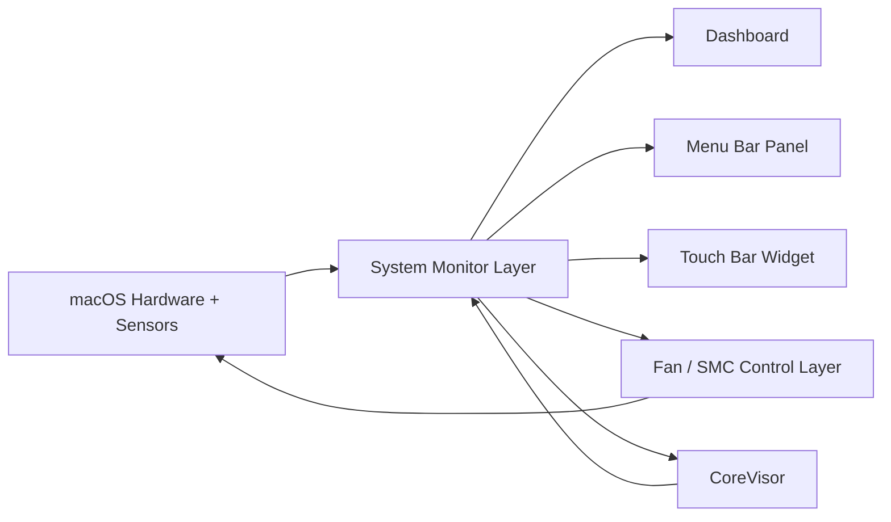
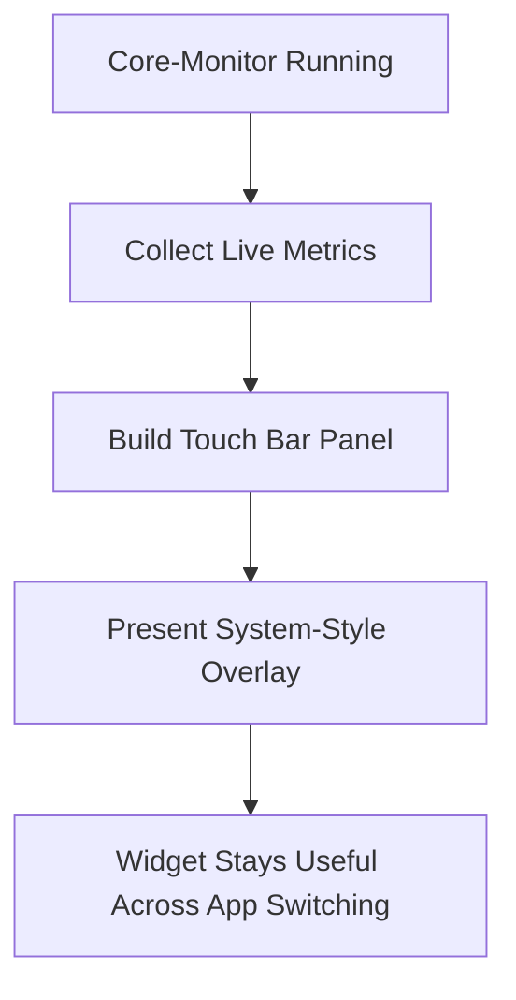
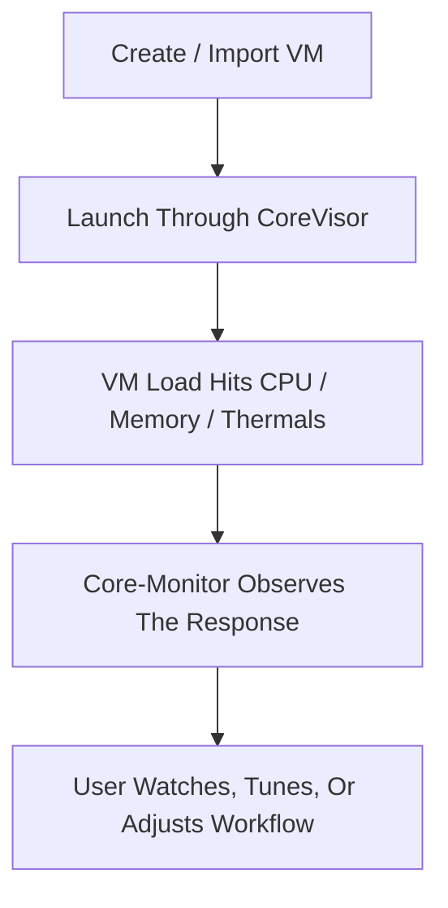

# Core-Monitor

**Free, open-source macOS monitoring, fan control, Touch Bar, and virtualization utility.**  
Dashboard + menu bar + Touch Bar widget + CoreVisor.

Built as a native Swift app for macOS. No subscriptions. No telemetry. No Electron shell. No paid “pro” tier hiding the interesting features.

Core-Monitor is not just a stats window. It is meant to be a serious all-in-one utility for people who want:

- live machine telemetry
- real fan control
- SMC-backed features
- menu bar visibility
- a genuinely useful Touch Bar widget
- built-in VM workflows through CoreVisor

## Why Core-Monitor?

A lot of Mac utility apps make you pick one of these:

- clean UI, but barely any features
- powerful features, but bloated or ugly
- useful controls, but locked behind a paid upgrade
- hardware monitoring, but no real interaction
- fan control, but no broader system view
- menu bar metrics, but nothing deeper than a tiny popup

Core-Monitor was built to avoid that tradeoff.

The goal is to give you one app that can stay open all day and still earn its place:

- detailed enough to matter
- light enough to keep running
- broad enough to replace several smaller utilities
- open enough that the weird low-level parts are inspectable

That is why the project combines monitoring, fan control, Touch Bar overlays, and CoreVisor instead of stopping at one narrow feature.

## What Core-Monitor Actually Is

| Area | What it covers |
| --- | --- |
| Dashboard | Live CPU, memory, thermals, power, battery, fan state, and VM-aware monitoring |
| Menu Bar | Quick status, quick controls, fast app access |
| Fan Control | SMC-backed fan write support through a privileged helper |
| Touch Bar | Persistent live hardware widget while the app is open |
| CoreVisor | Built-in VM setup, management, and runtime workflows |
| Open Source | The app, helper, and CoreVisor logic are visible in the repo |

Core-Monitor is built around one idea: system data should not just be visible, it should be useful across multiple surfaces.

## Feature Summary

### Monitoring

- Live CPU activity
- Apple silicon E-core / P-core aware monitoring
- Memory usage and memory pressure
- Thermal readings
- Power information
- Battery information
- Fan RPM visibility
- Rolling graph-style summaries in the dashboard
- Live status surfaced in the menu bar and Touch Bar

### Fan Control / SMC

- Fan control support
- SMC-backed system features where available
- One-app flow for seeing thermals and reacting to them
- Fast access to fan actions from the interface
- Helper-backed write path instead of keeping everything read-only

### Menu Bar

- Quick machine status without opening the full dashboard
- Fast access to app actions
- Fan, battery, and SMC state visibility
- CoreVisor access directly from the menu bar UI

### Touch Bar Widget

- Live Touch Bar metrics while the app is open
- Not limited to the app staying frontmost
- Designed as a real status surface, not a throwaway shortcut strip
- Useful for seeing load, memory, fan, and VM state while working elsewhere

### CoreVisor

- Built-in VM workflows inside the same app
- Apple Virtualization support for Linux guests in the current build
- QEMU-based workflows for broader guest support
- Windows 11 ARM automation path
- VirtIO driver handling
- Snapshot support
- USB passthrough support
- TPM support through `swtpm`

## UI Preview

### Dashboard


### Menu Bar Panel


## Architecture At A Glance



Core-Monitor is not structured like a tiny menu bar app with a bonus window. The same machine state powers every surface:

- the dashboard for depth
- the menu bar for immediacy
- the Touch Bar for persistent visibility
- CoreVisor for workload-aware system interaction

## Dashboard

The dashboard is the main “deep view” of the app.

It exists because quick menu bar stats stop being enough once you care about:

- CPU behavior under sustained load
- memory pressure instead of just memory used
- thermal behavior over time instead of a single instant value
- fan state and intervention
- what a VM is doing to the machine

The dashboard is meant to answer practical questions fast:

- What is my Mac doing right now?
- Is the machine getting hotter or stabilizing?
- Are fans reacting the way I expect?
- Is memory pressure becoming a real issue?
- Did starting a VM meaningfully change thermals or power?

That is the difference between a decorative monitor and a useful one.

## Menu Bar Utility

The menu bar part of Core-Monitor is not just a launcher. It is meant to be usable enough that you can rely on it for quick checks and quick actions without fully opening the dashboard every time.

The menu bar is there for:

- live at-a-glance status
- quick access to app actions
- fast fan and system checks
- jumping into CoreVisor
- restoring or switching behavior without opening a larger control surface

That gives the app a useful “always close by” mode instead of forcing the full dashboard for every interaction.

## Touch Bar Widget

The Touch Bar support is one of the most distinctive parts of Core-Monitor.

Normally, app Touch Bar content disappears as soon as you switch focus to another app. Core-Monitor goes further by using reverse-engineered Touch Bar presentation APIs to show a system-style modal Touch Bar overlay.

That matters because it changes the feature from a novelty into an actually useful hardware HUD.

Instead of only existing while Core-Monitor is frontmost, the Touch Bar widget can stay relevant while you:

- code
- browse
- edit
- render
- manage a VM

### What the Touch Bar widget is for

The widget is meant to stay compact, but still tell you the things that matter most:

- Is CPU load spiking?
- Is memory climbing?
- Are fans ramping?
- Are there active VMs?

It is not trying to mirror the entire dashboard. It is trying to keep the most important machine-state signals visible without taking up screen space.

### Why this is different from normal Touch Bar support

Core-Monitor does not treat the Touch Bar like a row of throwaway app shortcuts. It treats it like a status surface.

That is why the reverse-engineered overlay behavior matters:

- the widget stays useful across app switching
- the Touch Bar becomes a persistent live strip instead of a per-window accessory
- older Touch Bar hardware gets a legitimate systems-use case again

### Touch Bar Flow



### Touch Bar expectations

- Touch Bar features only matter on Macs that actually have Touch Bar hardware.
- The widget is most useful when you keep Core-Monitor running in the background.
- The point is persistent visibility, not full interactivity or dashboard duplication.

## Fan Control And `smc-helper`

Core-Monitor includes real fan-control paths, which means it needs more than passive sensor reads.

The project includes a separate helper binary, `smc-helper`, for fan write access. The app looks for it in places like:

- `/Library/PrivilegedHelperTools/ventaphobia.smc-helper`
- `/usr/local/bin/smc-helper`
- `/opt/homebrew/bin/smc-helper`

### Why a helper exists

Fan writes are a different class of operation than reading telemetry. A proper fan-control workflow needs elevated behavior, so Core-Monitor separates that into the helper instead of pretending everything can happen as a normal read-only app.

### What to expect

- You can use the dashboard and most monitoring features without needing helper write access.
- Fan writes require the helper path to be available and approved.
- The app can attempt privileged execution when needed.
- If helper setup is missing, the app reports that instead of silently failing.

### Fan control in practice

The point of fan control here is not to be a gimmick toggle. It matters because Core-Monitor is supposed to connect observation with action:

- see the thermals
- see the fan state
- change behavior
- immediately watch the machine respond

That makes the monitoring layer more useful than pure read-only telemetry.

## Launch At Login

Core-Monitor includes launch-at-login support through macOS login item registration.

Practical notes:

- Launch at login requires macOS 13 or newer in the current implementation.
- On some systems, approval may need to happen in `System Settings -> General -> Login Items`.
- If macOS says approval is required, that is normal system behavior for login items.

## CoreVisor

CoreVisor is the virtualization side of Core-Monitor.

This is one of the biggest things that separates the app from a normal monitoring utility. CoreVisor makes the app useful not just for observing load, but for participating in the workflows that create that load.

Virtual machines stress exactly the things Core-Monitor is already watching:

- CPU activity
- memory usage and pressure
- fan behavior
- thermals
- power draw

That is why CoreVisor belongs here. It keeps monitoring and workload management in the same app.

## CoreVisor Backend Model

CoreVisor currently supports two backend paths:

| Backend | Current role |
| --- | --- |
| Apple Virtualization | Linux guests in the current build |
| QEMU | Broader VM workflows, including Windows 11 ARM and other guests |

### Apple Virtualization

In the current build, Apple Virtualization is the lightweight native path for Linux guests.

That path matters because it gives CoreVisor a native macOS virtualization mode where supported, instead of routing everything through QEMU.

### QEMU

QEMU is the broader compatibility and power-user backend.

CoreVisor looks for bundled or custom QEMU binaries. If no usable QEMU binary is found, CoreVisor reports that clearly instead of pretending everything is fine.

Bundled QEMU is expected in the app’s `EmbeddedQEMU` resources. The repo includes [EmbeddedQEMU/README.md](EmbeddedQEMU/README.md) describing the expected layout.

Expected bundled binaries include:

- `qemu-system-aarch64`
- `qemu-system-x86_64` as optional fallback
- `qemu-img`

## CoreVisor Features

### VM creation and management

CoreVisor is not just a launch button for one hardcoded VM. It supports a broader management flow built around:

- guest templates
- VM bundle storage
- runtime state tracking
- logs
- hardware/resource configuration
- import and editing flows

### Guest types

The codebase supports guest categories such as:

- Linux
- Windows
- NetBSD
- UNIX

and uses backend compatibility rules to determine what is actually valid in the current build.

### USB passthrough

CoreVisor can enumerate QEMU USB devices and expose passthrough options in the setup flow.

That matters for more serious VM use because it moves the app beyond a minimal “boot this image” implementation.

### Snapshots

CoreVisor includes snapshot support for running QEMU machines:

- save snapshot
- load snapshot
- delete snapshot
- list existing snapshots

That makes it much more practical for testing, unstable guests, and iterative VM workflows.

### VirtIO support

For Windows-on-QEMU workflows, CoreVisor has explicit VirtIO handling:

- VirtIO ISO download support
- per-machine VirtIO path persistence
- guidance inside the UI for Windows ARM storage-driver behavior

This matters because Windows ARM install flows are not “just attach ISO and go.”

### VirGL and graphics-related options

CoreVisor includes VirGL- and VirtIO GPU-related logic for QEMU where supported.

That gives the project room to be more than a minimal headless VM wrapper.

### TPM support

CoreVisor supports TPM-related workflows through `swtpm`.

That matters especially for Windows 11 ARM flows, where TPM support is part of making the setup path viable.

If `swtpm` is missing, the UI explicitly points users toward:

```bash
brew install swtpm
```

## Windows 11 ARM “Do It For Me” Flow

One of the more ambitious CoreVisor features is the automated Windows 11 ARM setup path.

This is not just “attach an ISO and good luck.” The codebase includes an automation pipeline that can:

- download the Windows 11 ARM ISO
- download VirtIO drivers
- prepare setup-support media
- initialize TPM through `swtpm`
- build an unattended installation flow

The app describes this as a “Do It For Me” Windows 11 ARM setup path, and that is exactly the kind of feature that makes CoreVisor more than a generic VM launcher.

### Practical Windows 11 ARM expectations

- `swtpm` is required for the TPM path.
- VirtIO drivers matter during and after installation.
- The setup flow is much more guided than a raw QEMU command-line workflow.
- This is one of the most advanced parts of the app and one of the clearest examples of the project’s ambition.

## Why CoreVisor Changes The App

Without CoreVisor, Core-Monitor would still be a good monitoring utility.

With CoreVisor, it becomes a broader power-user tool that can both:

- observe the system
- participate in the workloads stressing the system

That changes the identity of the app.

### CoreVisor concept flow



## Why Open Source Matters

Core-Monitor is open source because a project doing low-level macOS-specific things becomes more valuable when people can inspect it.

That matters for:

- monitoring logic
- SMC-backed behavior
- fan control paths
- reverse-engineered Touch Bar overlay behavior
- CoreVisor backend logic

Open source here means:

- no feature paywall hiding the interesting parts
- no black box around the weird low-level behavior
- easier contribution and experimentation
- easier auditing of the advanced pieces

If a utility app is doing unusual hardware- and system-adjacent things, it should not be opaque.

## Install

## Option A: Download a release

Download the latest release build from the project’s GitHub releases page, then open the app normally.

Because the app is not signed with a paid Apple Developer certificate, macOS may block the first launch. The Gatekeeper flow is documented further below.

If you want fan write access, expect a one-time approval/admin flow for the helper path when the app first needs it.

## Option B: Build from source in Xcode

```bash
open Core-Monitor.xcodeproj
```

Then build and run the `Core-Monitor` scheme in Xcode.

This repo also contains:

- the main app target
- the `smc-helper` target
- the `EmbeddedQEMU` directory used for CoreVisor resource bundling

If you want CoreVisor to use bundled QEMU binaries in development, follow the resource layout described in [EmbeddedQEMU/README.md](EmbeddedQEMU/README.md).

## After install

After the app is built or downloaded:

1. Open `Core-Monitor`
2. Allow first launch through Gatekeeper if macOS blocks it
3. If you want fan writes, approve/install the helper path when prompted
4. If you want launch-at-login, enable it from the app and approve it in Login Items if macOS asks
5. If you want Windows 11 ARM in CoreVisor, install `swtpm`

## First Launch On macOS

Because Core-Monitor is not signed with a paid Apple Developer certificate, macOS may block it on first launch with a message saying Apple could not verify that it is free from malware. If you downloaded it from this repo and trust the build, you can allow it manually.

### First-launch steps

1. Try to open `Core-Monitor` once.
2. When macOS blocks it, press `Done`.
3. Open `System Settings`.
4. Go to `Privacy & Security`.
5. Find the blocked app notice and press `Open Anyway`.
6. Confirm the follow-up dialog by pressing `Open Anyway`.

### Step 1: macOS blocks the app on first launch


### Step 2: Open System Settings


### Step 3: In Privacy & Security, press Open Anyway


### Step 4: Confirm the launch


## Compatibility

Core-Monitor is mainly aimed at modern Macs, especially Apple silicon systems, but it is not limited to them.

- Apple silicon support is a major focus
- E-core / P-core monitoring is available where supported
- Fan control, CoreVisor, Touch Bar features, and SMC functionality are working on tested Apple silicon systems
- Intel support is also present and has been tested on a 2015 MacBook Air
- Some Apple silicon-specific features are automatically disabled on Intel Macs
- Fan curve control on Intel is still not working correctly
- Launch at login requires macOS 13 or newer in the current implementation
- Touch Bar features obviously require Touch Bar hardware to matter

### Tested systems

| Machine | Status |
| --- | --- |
| MacBook Pro 13-inch M2 | Tested |
| MacBook Air 2015 Intel | Tested |

Compatibility coverage is still early and should improve as more machines are tested.

## What This App Is For

Core-Monitor is especially useful if you want one app that covers:

- machine monitoring
- fan control
- menu bar status
- Touch Bar visibility
- VM workflows

It is a good fit for:

- Apple silicon users who care about E-core / P-core behavior
- people who want more than a tiny menu bar graph
- Touch Bar Mac users who want that hardware to do something useful
- people who run VMs and want to watch how they affect the system
- users who prefer open-source utilities over closed, feature-gated apps

## What This App Is Not

Core-Monitor is probably not for you if you want:

- a tiny one-feature widget
- a fan-only tool and nothing else
- an App Store-style sealed experience with zero rough edges
- a minimal monitor that never tries anything unusual

The app is intentionally broader and more experimental than that.

## FAQ

### Do I need the helper to use Core-Monitor?

No. Monitoring and general app usage can work without full fan-write access. The helper matters when you want the app to perform privileged fan-related actions.

### Do I need a Touch Bar Mac to use the app?

No. Touch Bar support is an extra surface, not the whole product. The dashboard, menu bar, CoreVisor, and monitoring features still matter without it.

### Do I need QEMU for CoreVisor?

For broader CoreVisor guest support, yes. CoreVisor prefers bundled or otherwise detected QEMU binaries. The Apple Virtualization backend is the native path for supported Linux workflows in the current build.

### Do I need `swtpm`?

Only for TPM-related VM flows, especially Windows 11 ARM setup. The app explicitly points users toward `brew install swtpm` when that path is missing.

### Is Core-Monitor just a monitor app?

No. Monitoring is the center of the app, but not the whole point. The app also includes control surfaces, Touch Bar behavior, and CoreVisor workflows.

## Current Direction

Core-Monitor is already useful, but it is still evolving. The direction is clear:

- better optimization
- wider compatibility
- more refined fan and SMC behavior
- deeper CoreVisor workflows
- a better Touch Bar and menu bar experience
- keeping the project open source and feature-rich without turning it into bloat

## Notes

- The app is still being actively refined.
- Testing coverage is currently limited to a small number of machines.
- Some features are more mature than others.
- Reports, issues, and improvements are useful.

## License

Core-Monitor is open source. See [LICENSE](LICENSE) for the full license text.
