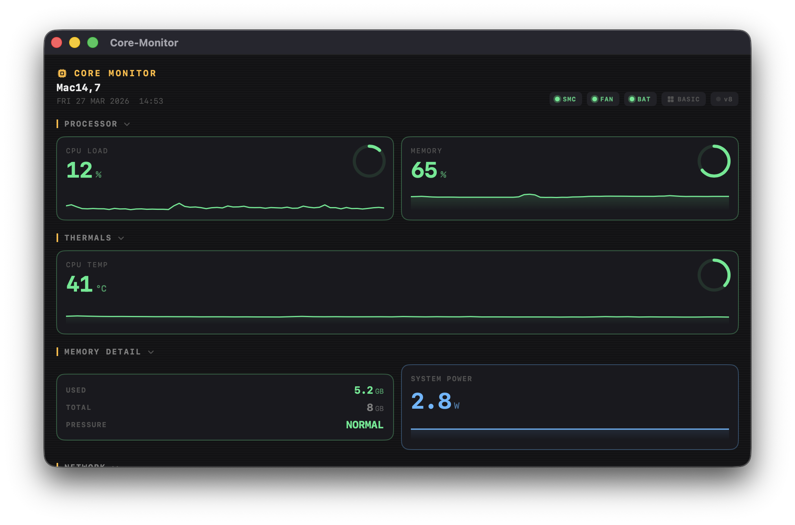
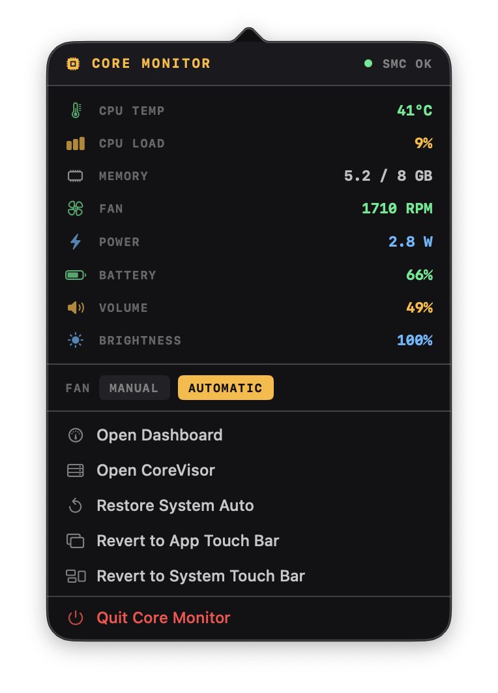

<p align="center">
  
</p>

<h1 align="center">Core-Monitor</h1>

<p align="center">
  macOS system monitor with fan control, menu bar stats, and Touch Bar support.
</p>

<p align="center">
  <a href="https://offyotto-sl3.github.io/Core-Monitor/">
    
  </a>
  <a href="https://github.com/offyotto-sl3/Core-Monitor/releases/latest">
    
  </a>
  <a href="https://github.com/offyotto-sl3/Core-Monitor">
    
  </a>
  <a href="./LICENSE">
    
  </a>
</p>

<p align="center">
  
  
  
</p>

---

## what is this

i made this because most free mac fan control apps:
- don’t support the touch bar  
- feel outdated  
- or lock basic features behind a paywall  

this keeps things simple and in one place.

---

<p align="center">
  
</p>

<p align="center">
  
</p>

---

## features

- cpu / gpu / memory usage  
- battery stats  
- fan control (manual + auto)  
- temps, voltage, power  
- menu bar stats  
- touch bar widgets  

---

## install

download:
https://github.com/offyotto-sl3/Core-Monitor/releases/latest

or build:
```bash
git clone https://github.com/offyotto-sl3/Core-Monitor.git
