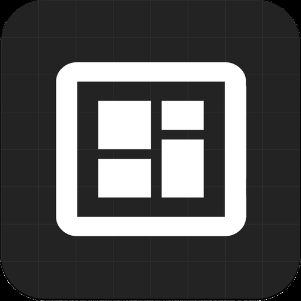
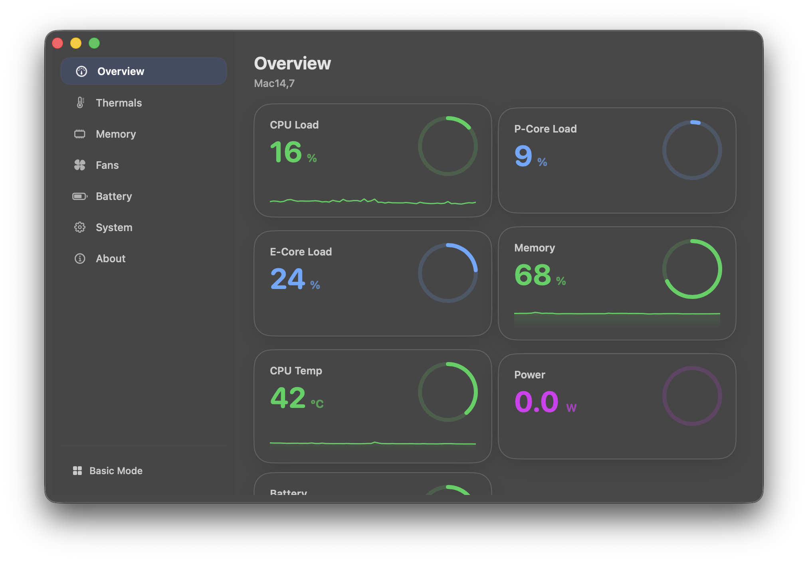
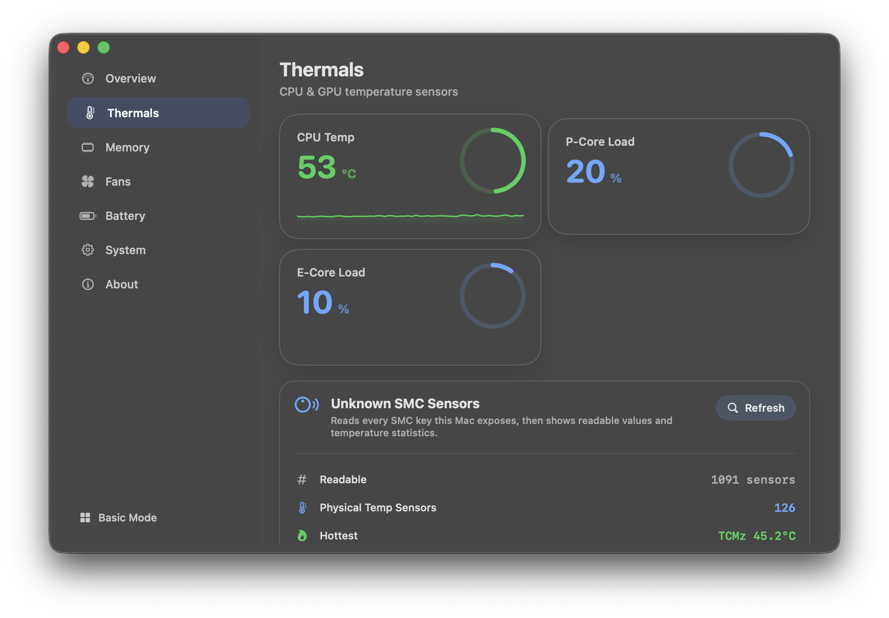
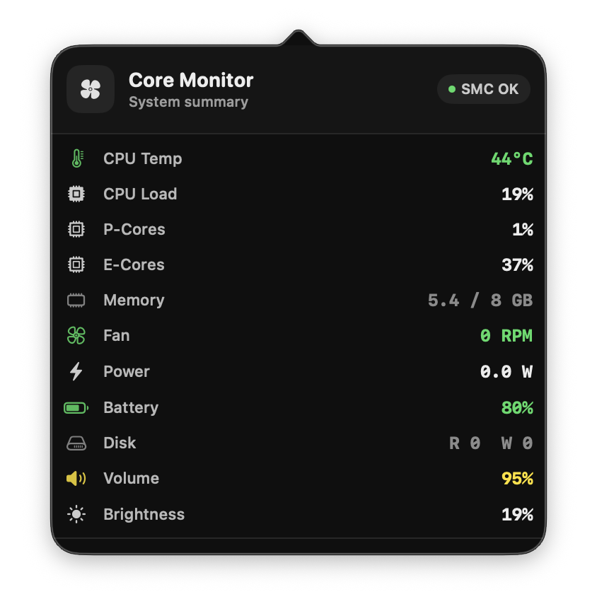

  

<h1 align="center">core-monitor</h1>

a native system monitor and fan controller for apple silicon macs. live readings in the menu bar, a full dashboard, and touch bar widgets. free.

  <a href="https://apps.apple.com/us/app/core-monitor/id6762558526?mt=12"><b>mac app store</b></a>
  ·
  <a href="https://github.com/offyotto/Core-Monitor/releases/latest/download/Core-Monitor.app.zip">direct download</a>
  ·
  <a href="https://offyotto.github.io/Core-Monitor/">website</a>
  ·
  <a href="./LICENSE">license</a>

  
  
  
  

---

## what it is

core-monitor reads sensor data straight from the apple smc and standard macos system apis, then shows it where you actually look: the menu bar, a full dashboard, and, on machines that have one, the touch bar. it also controls your fans when you want it to, and stays out of the way when you don't.

it runs locally, needs no account, and is built native for apple silicon rather than wrapped from a web app.

  

## what it monitors

cpu, gpu, memory, battery, thermals, power draw, fan speeds, network, and disk. readings come from the apple smc and system apis, so the numbers match what the hardware actually reports.

  

## fan control

core-monitor can take over fan speeds through a small privileged helper, then hand control back to macos when you turn it off. you can set fixed speeds or build custom curves. the controls are explicit on purpose, since this touches cooling on a machine you care about.

## menu bar and touch bar

- pick which readings sit in the menu bar and read them at a glance
- open a compact popover for a fuller summary without leaving what you are doing
- put live widgets on the touch bar if your mac has one

  

## how it compares

core-monitor is free and native. istat menus is paid, tg pro and macs fan control focus mainly on fans, and stats is free but has no fan control. core-monitor covers monitoring and fan control in one app, tuned for apple silicon, at no cost.

## install

- get it from the [mac app store](https://apps.apple.com/us/app/core-monitor/id6762558526?mt=12)
- or grab the [latest direct download](https://github.com/offyotto/Core-Monitor/releases/latest/download/Core-Monitor.app.zip)
- or build from source with xcode

the mac app store build is sandboxed and does not include fan control, since that needs a privileged helper. use the direct download if you want fan control.

## privacy

no account, no sign in, no telemetry required. everything runs on your machine.

## compatibility

- macos 13 or later
- apple silicon is the primary target

## license

gpl-3.0, see [LICENSE](./LICENSE).
